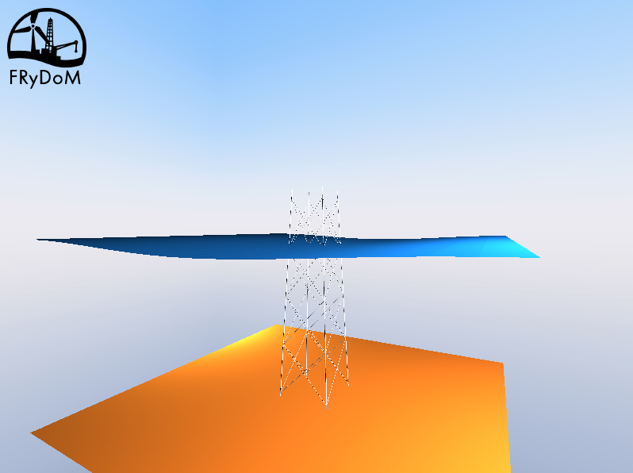
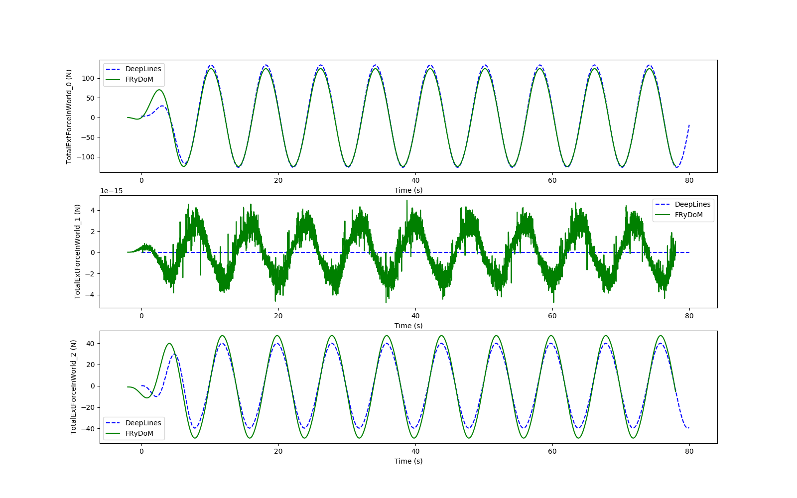

.. _bench_jacket_offshore_structure:

Benchmark Jacket Offshore - Comparison FRyDoM / DeeplinesWind
~~~~~~~~~~~~~~~~~~~~~~~~~~~~~~~~~~~~~~~~~~~~~~~~~~~~~~~~~~~~~

This benchmark is dedicated to the validation of the assembly of morison elements into
an offshore jacket structure. Comparison with the restuls from DeeplinesWind [DLW2013]_ have been made.

The following figure shows a 3D representation of the jacket structure in FRyDoM.

.. _fig_jacket_structure_3D_view:

    Representation of the Offshore Jacket Structure.

The water depth is equal to 45m. The offshore jacket structure is 60m height and 15 m large at its base. 
The diameter of the legs of the structure are 0.12m and the diameters of the diagonal braces
are 0.06m.
For all elements, the drag coefficient cd = 1. and the inertia coefficient cm = 2.

Fixed structure
---------------

The offshore jacket structure is fixed, mounted on the bottom. A regular wave with amplitude 0.1 m and 8s period is considered. 

The following figure shows the time serie of the global hydrodynamic force on the jacket 
structure. Results are compared with the results from DeeplinesWind.

.. _fig_jacket_hydro_force:

    Time series of the global hydrodynamic force on the fixed offshore jacket structure fixe
    to the bottom. Comparison between FRyDoM results (green line) and DeeplinesWind (blue lines).

References
----------

.. [DLW2013] T. Perdrizet, J-C Gilloteaux, D. Teixeira, G. Ferrer, L. Piriou, D. Cadiou, J-H Heurtier, C. Le Cunff, "Fully coupled floating wind turbine simulator based on nonlinear finite element method - Part II : Validation results", OMAE, 2013, Nantes
