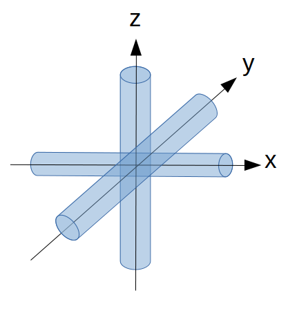
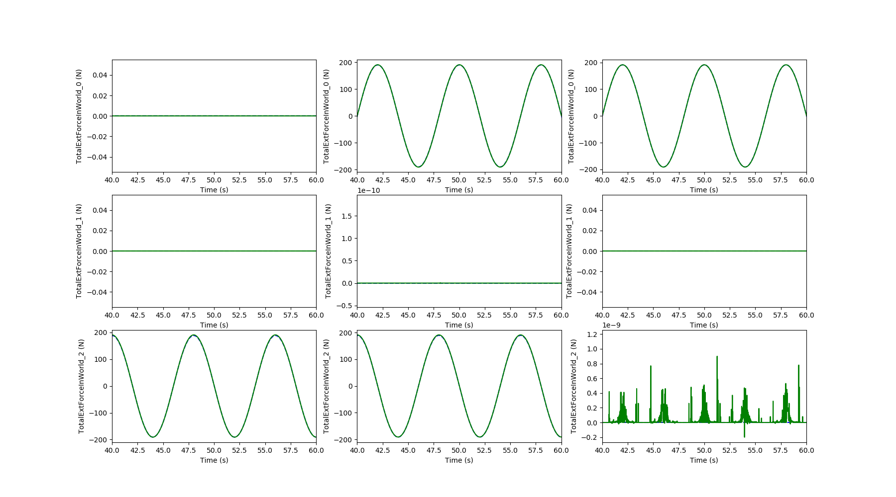
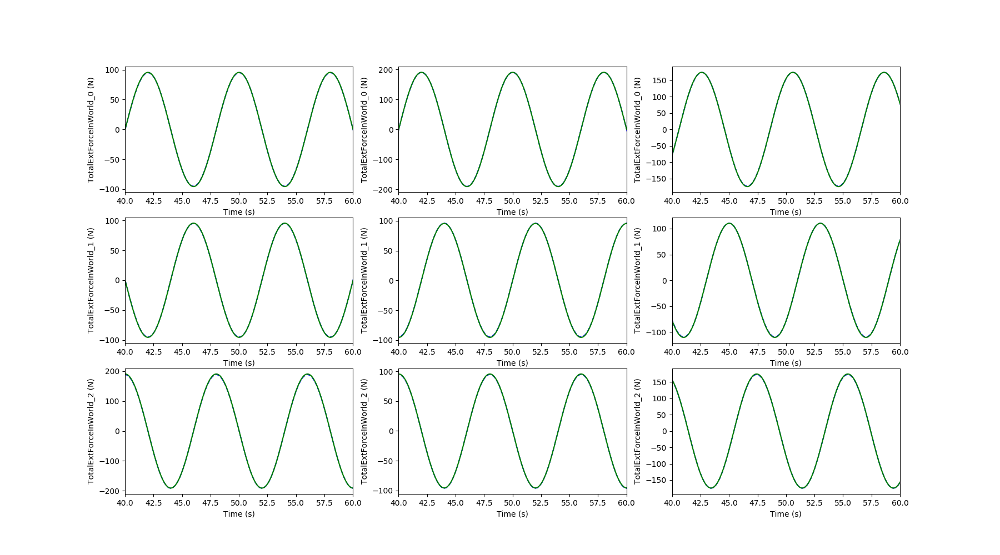
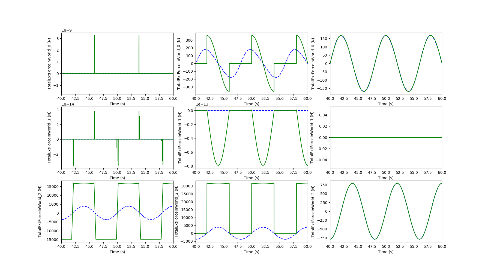
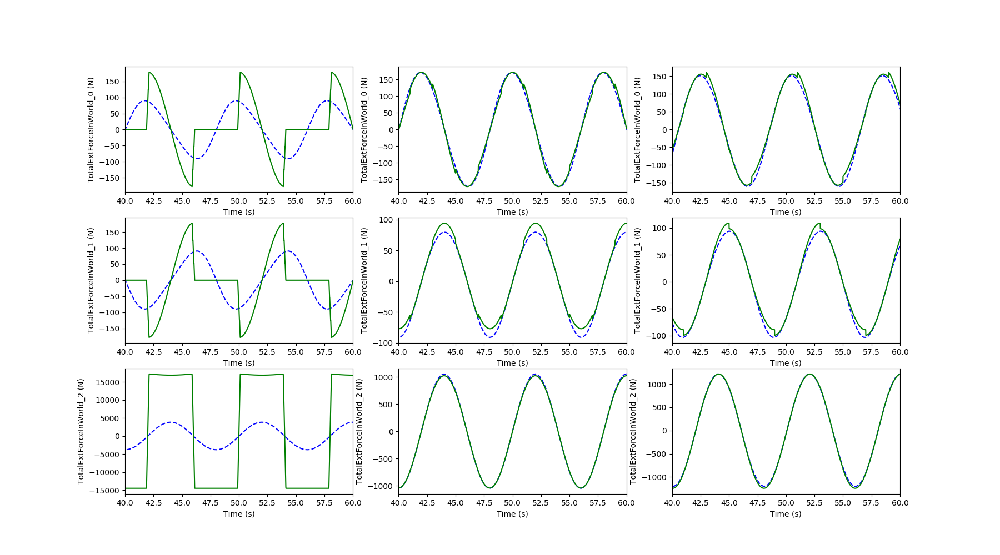

.. _bench_morison_model:

Morison model - Benchmark FRyDoM / DeeplinesWind
~~~~~~~~~~~~~~~~~~~~~~~~~~~~~~~~~~~~~~~~~~~~~~~~

This benchmark is dedicated to the validation of the full morison model in FRyDoM. Comparisons with 
the results from DeeplinesWind [DLW2013]_ have been made for one morison element both completly immersed and piercing 
the free surface. 

The properties of the morison element are listed into the following table

============================== ==========
Propertie                      Value
============================== ==========
Length                         4 m
Diameter                       1 m
Normal drag coeff (Cd)         0.6
Normal added mass coeff (Cm)   1.8
Axial drga coeff (Cd_a)        0.0
Axial added mass coeff (Cm_a)  0.0
============================== ========== 

Several direction are considered for the morison element: 

- aligned the main axis (x-axis, y-axis and z-axis) as represented in the next figure.

.. _fig_direction_morison_element

- aligned with diagnonal axis (xy-axis, yz-axis and xyz-axis).

Immersed elements
-----------------

The following results concern elements with center placed at 10 m under the free surface. A regular wave with 0.1 m
of amplitude and 8s period is considered. Elements are completely immersed during the simulation. The buoyancy contribution
have been removed from this results since they are constant in time.

.. _fig_immersed_main_axis_results:

    Time series of the morison force for a morison element aligned with the x-axis (left plots), y-axis (center plots) and 
    the z-axis (right plots). Comparison of the FRyDoM results (green) to DeeplinesWind results (blue).

.. _fig_immersed_diag_axis_results:

    Time series of the morison force for a morison element aligned with the xy-axis (left plots), yz-axis (center plots) and 
    the xyz-axis (right plots). Comparison of the FRyDoM results (green) to DeeplinesWind results (blue).

Very good agreement between the FRyDoM and DeeplinesWind results are found in all the direction of the morison
element.

Surface piercing elements
-------------------------

The following results concern elements with center placed at the free surface (z=0). A regular wave with amplitude
equal to 0.1m and 8s period is considered. Elements are crossing the free surface in this case.

.. _fig_piercing_main_axis_results:

    
    Time series of the morison force for a morison element aligned with x-axis (left plots), y-axis (center plots), and 
    the z-axis (right plots). Comparison of the FRyDoM results (green) to DeeplinesWind results (blue).

.. _fig_piercing_diag_axis_results:

    
    Time series of the morison force for a morison element aligned with xy-axis (left plots), yz-axis (center plots) and
    the xyz-axis (right plots). Comparison of the FRyDoM results (green), to DeeplinesWind (blue).

Good agreement can be observed for the elements aligned with the z-axis, yz-axis and xyz-axis. Small depreciancies 
and discontinuities on the FRyDoM results can be observed since the no progressive variation of the buoyancy
is used when the element are crossing the surface. A discontinuity appears when elements switch from immersed to emmerged
element. Those discontinuities are more pronouced for horizontal bar elements (aligned with x-axis, y-axis and xy-axis)
as it can be observed on the previous figures. Improvment on the buoyancy force would reduce this differences.

References
----------

.. [DLW2013] T. Perdrizet, J-C Gilloteaux, D. Teixeira, G. Ferrer, L. Piriou, D. Cadiou, J-H Heurtier, C. Le Cunff, "Fully coupled floating wind turbine simulator based on nonlinear finite element method - Part II : Validation results", OMAE, 2013, Nantes

