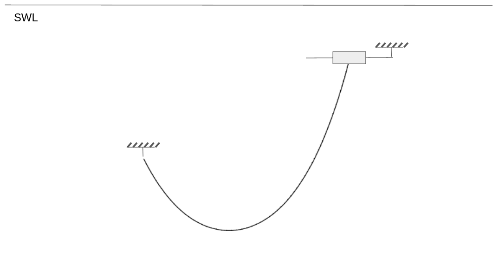
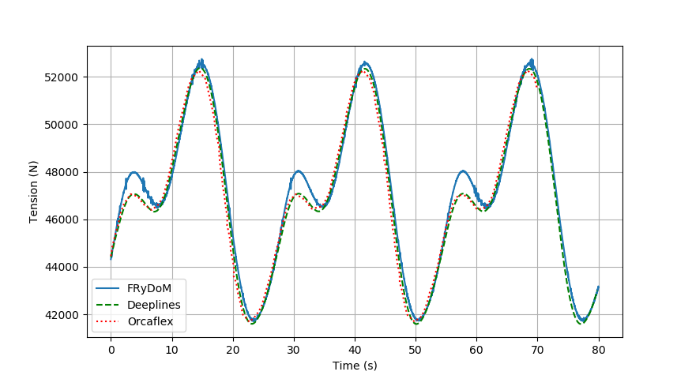
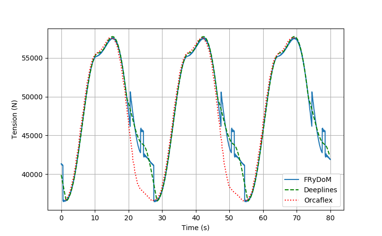
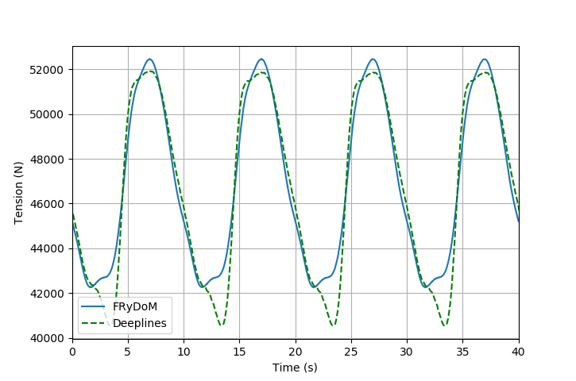
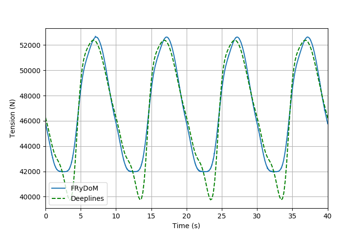
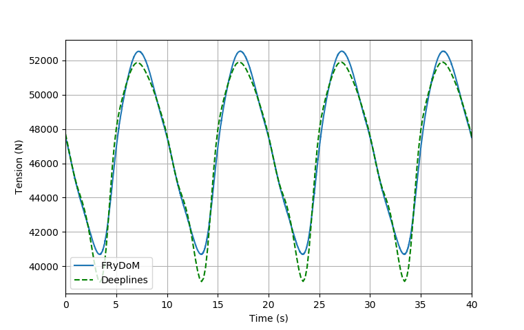
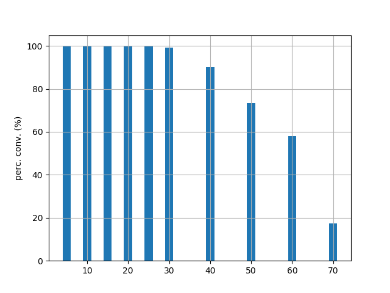
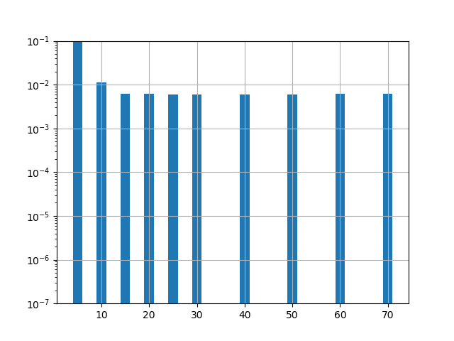

.. _bench_hanging_cable:

Validation hanging cable - Comparison FRyDoM / DeeplinesWind / Orcaflex
=======================================================================

Test case
---------

This benchmark is dedicated to a line which was pinned at both ends. The results are compared with those
obtained through Orcaflex [ORCA2006]_ and DeeplinesWind [DLW2013]_. The horizontal and vertical distances between the top 
and the bottom ends are 100 m and 50 m respectively and the top node is positioned at a water depth of 5 m.

.. _fig_hanging_cable

The following table resumes the main properties of the cable

==================================== ==================================
Properties                           Value
==================================== ==================================
Total unstretched length             170.0 m
Outer diameter                       0.396 m
Dry mass                             0.165 te/m
EA                                   500,000 kN
EI                                   120.8 kNm^2
==================================== ==================================

Static Analysis
---------------

In the static analysis the top node and bottom node remain fixed and no wave is considered. The cable is only
submitted to its own mass and buoyancy. Top and bottom tensions of the cable are compared to Orcaflex and DeeplinesWind results in the following table.

================================= ========= ========= ============= =======
            -                     Orcaflex  Catenary  DeeplinesWind  FRyDoM    
================================= ========= ========= ============= =======
Top Tension (kN)                  47.11     47.14     46.64         47.14
Bottom Tension (kN)               26.6      26.6      26.63         26.63    
Vertical reaction, top (kN)       45.71     45.72     45.21         45.72      
Horizontal reaction, top (kN)     11.4      11.47     11.47         11.47
Vertical reaction, bottom (kN)    24.04     24.03     24.03         24.03
Horizontal reaction, bottom (kN)  -11.4     -11.47    -11.47        -11.47
================================= ========= ========= ============= =======

Very good agreement is found between the tension results obtained by FRyDoM and the 
benchmark results from other models.

Harmonic motion in surge
------------------------

The top node is animated with an harmonic motion in surge with an amplitude of 10m and 
a period of 27s.

The time series of the top node tension is compared to Orcaflex and DeeplinesWind results
in the next figure.

.. _fig_surge_motion:

    Tension of the cable at the top node with harmonic surge motion of the top node.

Very good agreement is found between the result from FRyDoM and the tension given by Orcaflex 
and DeeplinesWind.

Harmonic motion in heave
------------------------

The top node is animated with an harmonic motion in heave with an amplitude of 10m a
and a period of 27s.

The time series of the top node tension is compared to Orcaflex and DeeplinesWind results 
in the next figure.

.. _fig_heave_motion:

    Tension of the cable at the top node with harmonic heave motion of the top node.

Discontinuities on the frydom results can be seen on the previous figure. This discontinuities corresponding to the 
part of the simulation when the cable goes out the water and cross the free surface. An element can be considerer in or out 
the water but not partially immersed. A progressive variation of the immersed volume of an element would help to avoid those
instabilities.

Single Airy wave
----------------

The variation of the tension on the cable due to the effect of regular wave is analysed in
this section. A single airy wave of amplitude 5m and with a period of 10s is considered here.
Three directions are considerered : 0 deg, 45 deg and 90 deg. 
Time series of the end node tension compared to the results of DeeplinesWind are presented in the next figures.

.. _fig_airy_0:

    Tension of the cable at the top node with a regular wave (T=10s, A=5m) with direction 0 deg.

.. _fig_airy_45:

    Tension of the cable at the top node with a regular wave (T=10s, A=5m) with direction 45 deg.

.. _fig_airy_90:

    Tension of the cable at the top node with a regular wave (T=10s, A=5m) with direction 90 deg.

The tension at the top point on the line when influenced by regular wave agree well
with the tension values given by DeeplinesWind simulation expect on the peak and crest 
of the tension.

Convergence study
-----------------

The dynamic cables are based on Finite Element model and BSpline functions. The cable is represented
by a set of BSpline functions and its discretization can be managed by a number of control points.
The influence of the number of control point on the accuracy and convergence of the simulation
have been study for the harmonic surge motion test case. 

A number of control points between 5 points and 70 points have been chosen. The number of 
control point has a direct influence on the convergence of the constraint solver.
The next figure represents the evolution of the convergence ratio of the constraint 
solver with the number of control point.

.. _fig_ratio_solver:

    Evolution of the ratio of convergence of the constraint solver with the number of 
    control point for the line.

We observe that the constraint solver presents a good convergence ratio until 30 control points but this ratio decreases
after this value. In this way 30 control points seems to be a maximal number of control point allowed
to satisfy the convergence of the contraint solver.

The next figure shows the evolution of the accuracy of the simulation with the number of 
control points.

.. _fig_accuracy_surge:

    
    Evolution of the accuracy of the simulation with the number of control points.

We observe that a maximum of precision is achieved at 15 control points. 

An optimal number of point control can be found from accuracy and convergence of the method.
It will be 15 control points for this case.

References
----------

.. [ORCA2006] Y. M. Low and R. Langley, "Dynamic analysis of a flexible hanging riser in the time and frequency domain", OMAE, 2016, UK
.. [DLW2013] T. Perdrizet, J-C Gilloteaux, D. Teixeira, G. Ferrer, L. Piriou, D. Cadiou, J-H Heurtier, C. Le Cunff, "Fully coupled floating wind turbine simulator based on nonlinear finite element method - Part II : Validation results", OMAE, 2013, Nantes

