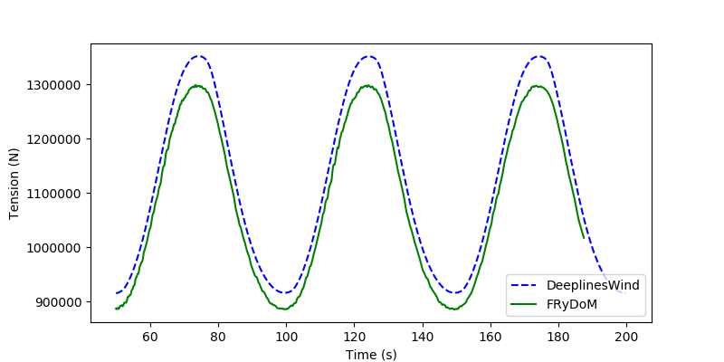
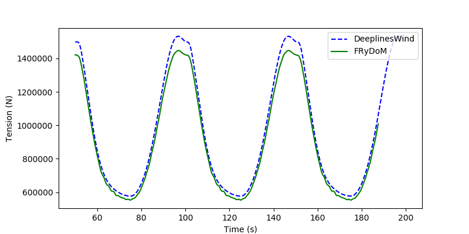

.. _bench_mooring_lines:

Validation mooring lines - Comparison FRyDoM / DeeplinesWind
============================================================

Test case
---------

In this benchmark, a Floating Offshore Wind Turbine (FOWT) platform with three mooring lines anchored to 
the bottom are considered. The platform is fixed or mooved with prescribed harmonic motion. The tension results
of the three mooring lines at the fairleads and anchor points are compared to DeeplinesWind [DLW2013]_ simulation. 

.. _fig_fowt_3D_view:

       
    3D view of the FOWT platform with the three mooring lines anchored to the seabed

The water depth is set equal to 200 m, the gravity acceleration is 9.81 m/s^2 and 
the water density is 1025 kg/m^3.

Mooring lines properties 
~~~~~~~~~~~~~~~~~~~~~~~~

The mechanical properties and morison coefficients of the mooring lines are listed 
in the next table.

======================== =====================
Properties               Value
======================== =====================
Diameter (m)             0.0766
Length (m)               835.5
Axial stiffness (N)      7.536E+08
Linear density (kg/m)    113.35 
Drag coeff. (normal)     1.1
Drag coeff. (tangential) 0.
Added mass  (normal)     1.
Added mass  (tangential) 0.
======================== =====================

Failead positions
~~~~~~~~~~~~~~~~~

The following table gives the cartesian coordinates of the fairlead in the platform 
reference frame.

======================== ===================================
Fairlead                 Position (in body reference frame)
======================== ===================================
T1                       {20.435, 35.4, -14}
T2                       {-40.87, 0., -14}
T3                       {20.435, -35.4, -14}
======================== ===================================

Anchor positions
~~~~~~~~~~~~~~~~

The following table gives the cartesian coordinates of the anchor point in the world
reference frame.

======================== ===================================
Anchor                   Position (in world reference frame)
======================== ===================================
G1                       {418.8, 725.383, -200}
G2                       {-837.6, 0., -200}
G3                       {418.8, -725.383, -200}
======================== ===================================

Environment set
~~~~~~~~~~~~~~~

The following table gives the environment simulated for the different comparison studies

========================================= ========================================== =======================
Motion                                    Waves                                      Current
========================================= ========================================== =======================
Harmonic surge (T=50s ; A=10m)            No                                         No
Harmonic heave (T=30s ; A=5m)             No                                         No
No                                        Regular wave (T=27s : A=5m ; dir = 0 deg)  No
No                                        Regular wave (T=27s ; A=5m ; dir = 90 deg) No                                      
No                                        No                                         yes
No                                        No                                         yes
========================================= ========================================== =======================   

Results
-------

Imposed surge motion 
~~~~~~~~~~~~~~~~~~~~

The motion of the platform is harmonic in surge, with a time period equal to 50 seconds
and an amplitude of 10 meters. Other degrees of freedom are fixed.

In the next figures we compare the tension of the three mooring lines at the corresponding fairleads between FRyDoM and DeeplinesWind

.. _fig_surge_motion_end_tension_1:

    Tension of the line 1 at the fairlead with a harmonic surge motion of the platform

.. _fig_surge_motion_end_tension_2:

    Tension of the line 2 at the fairlead with a harmonic surge motion of the platform

.. _fig_surge_motion_end_tension_3:

    Tension of the line 3 at the fairlead with a harmonic surge motion of the platform

In the next figures we compare the tension of the three mooring lines at the anchor points between FRyDoM and DeeplinesWind

.. _fig_surge_motion_start_tension_1:

    Tension of the line 1 at the anchor point with a harmonic surge motion of the paltform

.. _fig_surge_motion_start_tension_2:

    Tension of the line 2 at the anchor point with a harmonic surge motion of the platform

.. _fig_surge_motion_start_tension_3:

    Tension of the line 3 at the anchor point with a harmonic surge motion of the paltform

One can observe that the non-linearties are important on the dynamic of the mooring line and well capture in FRyDoM. The results of FRyDoM are
very close to the results from the benchmark model with a mean relative difference about 3.2%, 4.1% and 3.2% for
respectively the tension of the mooring lines 1, 2 and 3 at the fairleads. At the anchor points, the 
differences are about 3.9%, 4.7% and 3.9% for respectively the mooring lines 1, 2 and 3.

Imposed heave motion 
~~~~~~~~~~~~~~~~~~~~

The motion of the platform is harmonic in heave, with a time period equal to 30 seconds
and an amplitude of 5 meters. Other degrees of freedom are fixed.

In the next figures we compare the tension of the three mooring lines at the fairleads between FRyDoM and DeeplinesWind.

.. _fig_heave_motion_end_tension_1:

    Tension of the line 1 at the fairlead with a harmonic heave motion of the platform

.. _fig_heave_motion_end_tension_2:

    Tension of the line 2 at the fairlead with a harmonic heave motion of the platform

.. _fig_heave_motion_end_tension_3:

    Tension of the line 3 at fairlead with a harmonic heave motion of the platform

In the next figures we compare the tension of the three mooring lines at the anchor points between FRyDoM and DeeplinesWind.

.. _fig_heave_motion_start_tension_1:

    Tension of the line 1 at the anchor point with a harmonic heave motion of the platform

.. _fig_heave_motion_start_tension_2:

    Tension of the line 2 at the anchor point with a harmonic heave motion of the platform

.. _fig_heave_motion_start_tension_3:

    Tension of the line 3 at the anchor point with a harmonic heave motion of the platform

The tensions of the mooring lines simulated by FRyDoM follow the time evolution of the tensions given 
by the benchmark model with a constant offset around 4E+04 N. The non-linearities are correctly predicted.
The origin of the offset is investigated.

Regular waves
~~~~~~~~~~~~~

(in progress)

Uniform Current 
~~~~~~~~~~~~~~~

(in progress)

References
----------

.. [DLW2013] T. Perdrizet, J-C Gilloteaux, D. Teixeira, G. Ferrer, L. Piriou, D. Cadiou, J-H Heurtier, C. Le Cunff, "Fully coupled floating wind turbine simulator based on nonlinear finite element method - Part II : Validation results", OMAE, 2013, Nantes

